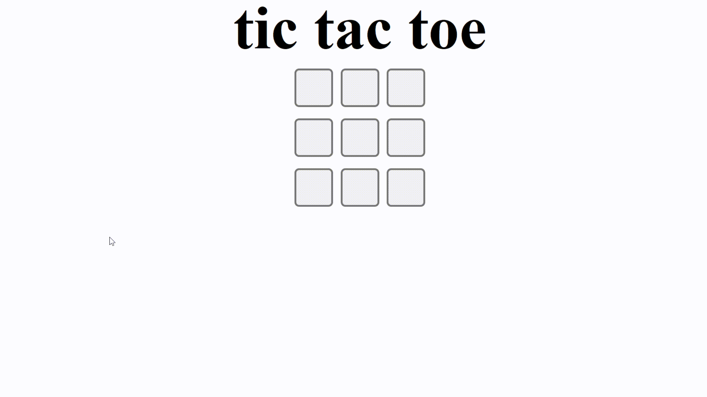
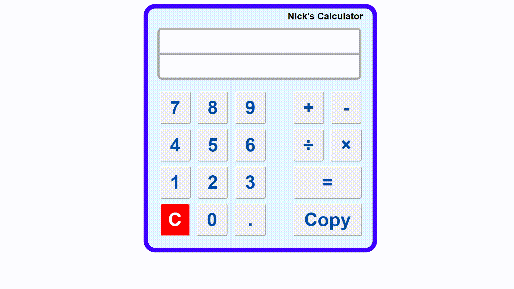

  
  
  
  

I am a mechanical engineer motivated to integrate the power of software technology into the industry. Therefore, I have gained the knowledge and skills necessary for software development and the potential to do much more. 

See [my website](#####) for more information!

<h1 align="center">Projects</h1>
<table bordercolor="black">
  
  <tr>
    <td width="50%" valign="top">
      <h3 align="center">Tic Tac Toe</h3>
         
        
         
        

          
    
  
      

        
<strong>HTML5, CSS3, & Javascript</strong> - A game of tic tac toe made as a group project with other software devleopers!

    </td>
    <td width="50%" valign="top">
      <h3 align="center">Simple Calculator</h3>
         
      
         
        

          
  
  
      

        
<strong>HTML5, CSS3, & Javascript</strong> - A simple JS calculator with a copy function

    </td>
  </tr>
  
  <tr>
    <td width="50%" valign="top">
      <h3 align="center">NASA Picture of the Day</h3>
       
        
       
        

  
  
      

        
<strong>HTML5, CSS3, & Javascript</strong> - Call a picture of a galaxy directly from NASA with their API!

    </td>
    <td width="50%" valign="top">
      <h3 align="center">Book Tracker</h3>
         
        
         
        

          
  
  
      

        
<strong>HTML5, CSS3, & Javascript</strong> - Track any book you want with its ISBN number, page numbers and tracked books are saved in local storage!

    </td>
  </tr>
</table>

<h1 align="center">Technologies</h1>

  

  
  
  
  
  
  
  
  
  
  
  
  
  

  

  
  

  

  

---

<h1 align="center">Connect</h1>

  

    
    
    
    
  

